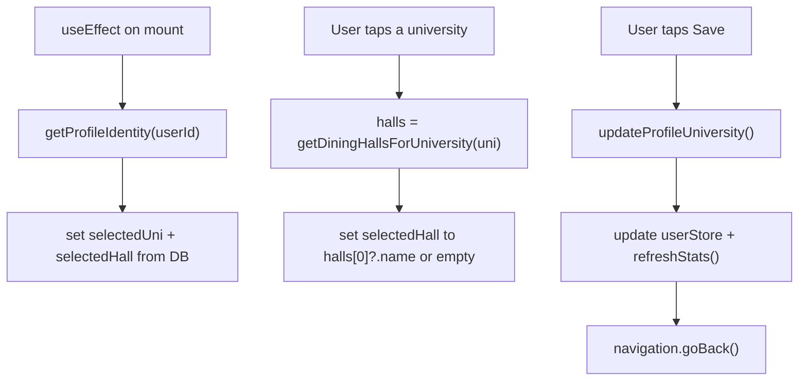

# Profile UX Build Spec

This document is a self-contained implementation spec. Another agent should be able to execute it end to end without additional context. Implement the tasks in order, verifying each before moving on.

## Overview

MacroLeague is a React Native (Expo) app backed by Supabase. Profile sub-screens are registered on a native stack navigator in `src/navigation/MainNavigator.tsx`. This spec fixes three user-reported gaps in the Profile and social experience:

| Item | Current state | This build |
|------|---------------|------------|
| Rewards back button | Missing — `RewardsScreen.tsx` takes no `navigation` prop and has no back UI | Add the standard back button |
| University dining halls | Mock only — `UniversitySettingsScreen.tsx` hardcodes four Rutgers halls (incl. the closed Brower Commons), never filters by university, and "Save" is a fake `Alert` | University-scoped dining data, filtering, and Supabase persistence |
| Accept friend requests | Backend and core UI already exist on the Leaderboard Friends tab, but requests are easy to miss | Discoverability polish (empty state, always visible, optional tab badge) |

Implement in this order: Task 1 (quick win), then Task 2 (main data/UX work), then Task 3 (polish). Run the full test plan at the end.

## Prerequisites

Verify these before testing:

1. Migration `supabase/migrations/0011_friendships_and_invites.sql` must be applied on the target Supabase project before testing any friend flow. If the Friends tab shows an error or friend RPCs fail, apply migrations `0001` through `0011` via the Supabase CLI or dashboard.
2. `.env` at the repo root must contain `EXPO_PUBLIC_SUPABASE_URL` and `EXPO_PUBLIC_SUPABASE_ANON_KEY`.
3. Run the app with `npm.cmd run web` on Windows PowerShell (`npm run web` may be blocked by the execution policy; `npm.cmd` avoids the `npm.ps1` wrapper).
4. The new column added in Task 2 requires the migration to be applied to Supabase before "Save" will persist. Implement the code regardless; the user applies the migration.

---

## Task 1: Rewards back button

Goal: give `RewardsScreen` the same back navigation every other Profile sub-screen already has (Edit Macro Goals, Scoring Rules, Notification Preferences, Linked University).

Reference pattern — `src/screens/main/UniversitySettingsScreen.tsx`:

```tsx
<TouchableOpacity onPress={() => navigation.goBack()} style={styles.backBtn}>
  <AppIcon name="back" size={17} color={Colors.primary} />
  <Text style={styles.backText}>Back</Text>
</TouchableOpacity>
```

The matching styles used across those screens are:

```tsx
backBtn: { flexDirection: 'row', alignItems: 'center', gap: 6, marginBottom: 16 },
backText: { fontFamily: FontFamily.bodyMedium, fontSize: 15, color: Colors.primary },
```

Changes in `src/screens/main/RewardsScreen.tsx`:

1. Change the signature from `export default function RewardsScreen()` to `export default function RewardsScreen({ navigation }: any)`.
2. `AppIcon` is already imported. Insert the back button block as the first child inside the `<ScrollView contentContainerStyle={styles.content}>`, immediately above `<Text style={styles.title}>REWARDS</Text>`.
3. Add `backBtn` and `backText` to the screen's `StyleSheet.create({ ... })`.

Note: the screen root is `View` wrapping a `ScrollView` whose `content` style already sets `paddingTop: 60`, so the back button sits below the status bar without extra offset.

Entry points that push this screen (both benefit): Profile ("My Rewards", `src/screens/main/ProfileScreen.tsx`) and Home (rewards link, `src/screens/main/HomeScreen.tsx`). Both use `navigation.navigate('Rewards')`, so `navigation.goBack()` returns to whichever pushed it.

Acceptance criteria:
- Tapping Back returns to the previous screen (Profile or Home) without reloading the page.
- Styling matches the other Profile sub-screens.

---

## Task 2: University settings — filtered dining halls + persistence

Goal: selecting a university filters the dining hall list to that school only, outdated Rutgers data is corrected, and the choice persists to Supabase (surviving reload).

### 2a. Dining data module

Create `src/data/universityDining.ts`:

```ts
export interface DiningHallOption {
  name: string;
  campus: string;
}

export const UNIVERSITIES: string[] = [
  'Rutgers University',
  'Princeton University',
  'Stevens Institute of Technology',
  'NJIT',
  'Seton Hall University',
  'Montclair State University',
  'Rowan University',
];

export const DINING_HALLS_BY_UNIVERSITY: Record<string, DiningHallOption[]> = {
  'Rutgers University': [
    { name: 'Busch Dining Hall', campus: 'Busch Campus' },
    { name: 'Livingston Dining Commons', campus: 'Livingston Campus' },
    { name: 'Neilson Dining Hall', campus: 'Cook/Douglass Campus' },
  ],
  'Princeton University': [
    { name: 'Butler College Dining Hall', campus: 'Butler College' },
    { name: 'Forbes College Dining Hall', campus: 'Forbes College' },
    { name: 'Mathey College Dining Hall', campus: 'Mathey College' },
    { name: 'New College West Dining Hall', campus: 'New College West' },
    { name: 'Rockefeller College Dining Hall', campus: 'Rockefeller College' },
    { name: 'Whitman College Dining Hall', campus: 'Whitman College' },
    { name: 'Yeh College Dining Hall', campus: 'Yeh College' },
  ],
  'Stevens Institute of Technology': [
    { name: 'Pierce Dining Hall', campus: 'Central Campus' },
  ],
  'NJIT': [
    { name: 'Highlander Commons', campus: 'Campus Center' },
  ],
  'Seton Hall University': [
    { name: 'Pirate Dining Room', campus: 'Bishop Dougherty University Center' },
  ],
  'Montclair State University': [
    { name: "Sam's Place", campus: 'Machuga Heights' },
    { name: 'Freeman Dining Hall', campus: 'Freeman Hall' },
  ],
  'Rowan University': [
    { name: 'Holly Pointe Commons', campus: 'Holly Pointe' },
  ],
};

export function getDiningHallsForUniversity(university: string): DiningHallOption[] {
  return DINING_HALLS_BY_UNIVERSITY[university] ?? [];
}
```

Scope note: residential / all-you-care-to-eat halls only. Do NOT add retail locations (cafes, food courts, franchise counters). Data was verified against official dining pages:
- Rutgers: https://food.rutgers.edu/places-eat — three AYCTE halls. Brower Commons closed ~2023; it is intentionally removed. The Atrium is a retail replacement and is intentionally excluded.
- Princeton: https://www.princeton.edu/one-community/housing-dining — seven residential college dining halls.
- Stevens: https://www.stevens.edu/student-life/the-stevens-experience/living-at-stevens/dining-at-stevens — Pierce Dining Hall is the AYCTE hall.
- NJIT: https://www.njit.edu/life/on-campus-dining — Highlander Commons is the continuous dining hall.
- Seton Hall: https://www.shu.edu/administration/dining-locations-and-hours.html — Pirate Dining Room is the main hall.
- Montclair: https://www.montclair.edu/dining-services/about-dining/ — two residential halls.
- Rowan: https://sites.rowan.edu/dining/ — Holly Pointe Commons is the AYCTE hall.

### 2b. Database migration

Create `supabase/migrations/0012_preferred_dining_hall.sql`.

Migration `0006_gamification_phase1_rules.sql` already grants column-level UPDATE to `authenticated`:

```sql
grant update (display_name, university, goal_type, avatar_url)
  on public.profiles to authenticated;
```

Add the new column and re-grant to include it. Read `0006` first and mirror its exact grant style so nothing is lost:

```sql
-- Adds a persisted preferred dining hall to profiles and extends the
-- column-level UPDATE grant established in migration 0006. Additive and
-- forward-only.
alter table public.profiles
  add column if not exists preferred_dining_hall text;

grant update (display_name, university, goal_type, avatar_url, preferred_dining_hall)
  on public.profiles to authenticated;
```

RLS already restricts writes to the caller's own row ("update own profile"), so no new policy is needed.

### 2c. Profile service

Extend `src/services/profileService.ts`:

1. Add an update payload type and function, mirroring `updateProfileGoals` (update, then `.select('id').maybeSingle()`, throwing `MISSING_PROFILE_MESSAGE` when no row matched):

```ts
export interface ProfileUniversityUpdate {
  university: string;
  preferredDiningHall: string;
}

export async function updateProfileUniversity(
  userId: string,
  update: ProfileUniversityUpdate,
): Promise<void> {
  const { data, error } = await supabase
    .from('profiles')
    .update({
      university: update.university,
      preferred_dining_hall: update.preferredDiningHall,
    })
    .eq('id', userId)
    .select('id')
    .maybeSingle();

  if (error) throw error;
  if (!data) throw new Error(MISSING_PROFILE_MESSAGE);
}
```

2. Extend `ProfileIdentity` and `getProfileIdentity` to carry the saved dining hall. Add `preferredDiningHall: string | null;` to the `ProfileIdentity` interface, add `preferred_dining_hall` to the `.select(...)` string and its `maybeSingle<{...}>()` generic, and return `preferredDiningHall: data.preferred_dining_hall` in the returned object.

Current select to extend:

```ts
.select('username, display_name, university, goal_type')
```

becomes:

```ts
.select('username, display_name, university, goal_type, preferred_dining_hall')
```

### 2d. User store sync

Extend `src/store/userStore.ts` and `src/types/index.ts`:

1. Add `preferredDiningHall?: string | null;` to the `UserProfile` interface in `src/types/index.ts`.
2. In `refreshStats()` in `userStore.ts`, the identity is already fetched via `getProfileIdentity`. Merge the new field into the cached user alongside the existing `university` line:

```ts
university: identity.university ?? state.user.university,
preferredDiningHall: identity.preferredDiningHall ?? state.user.preferredDiningHall,
```

### 2e. Rewrite UniversitySettingsScreen

Refactor `src/screens/main/UniversitySettingsScreen.tsx`.



Implementation details:

1. Remove the inline `UNIVERSITIES` and `DINING_HALLS` constants from this file. Import `UNIVERSITIES` and `getDiningHallsForUniversity` from `src/data/universityDining.ts`.
2. Import `getProfileIdentity` and `updateProfileUniversity` from `src/services/profileService.ts`, `supabase` from `src/lib/supabase`, and `useUserStore` from `src/store/userStore`. Also import `ActivityIndicator` from `react-native` for the load state.
3. On mount (`useEffect`), fetch the signed-in user id (`supabase.auth.getUser()`), call `getProfileIdentity(userId)`, then:
   - initialize `selectedUni` from `identity.university ?? 'Rutgers University'`;
   - compute that university's halls; initialize `selectedHall` from `identity.preferredDiningHall` if it exists in that list, otherwise the first hall's name (or `''` if the list is empty).
   - Use an `active` guard flag so an unmounted screen does not set state. Fall back to defaults on error rather than blocking the screen (same tolerance pattern as `EditGoalsScreen`).
4. Derive the rendered halls each render from `getDiningHallsForUniversity(selectedUni)` — never a static global array.
5. On university tap: `setSelectedUni(uni)` and reset `selectedHall` to the first hall of the new university's list (or `''` if empty). This guarantees a Rutgers hall can never stay selected under Montclair.
6. If the filtered hall list is empty, render a notice in place of the rows: "No dining halls listed for this university."
7. Save button handler: call `updateProfileUniversity(userId, { university: selectedUni, preferredDiningHall: selectedHall })`. On success, update the local store so the Profile header reflects the change immediately (`useUserStore.getState().refreshStats()` is sufficient since the row is now written), show `Alert.alert('Saved', 'University settings updated!')`, then `navigation.goBack()`. On failure, show an error `Alert` (mirror `EditGoalsScreen`'s catch block) and do not navigate away.
8. Keep the existing visual structure (title, subtitle, YOUR UNIVERSITY list, PREFERRED DINING HALL list, SAVE button) and existing styles; only the data source and handlers change.

Acceptance criteria:
- Selecting Montclair State University shows only Sam's Place and Freeman Dining Hall — never Busch, Livingston, or Neilson.
- Brower Commons never appears anywhere.
- Switching universities always resets the selected hall to one that belongs to the newly selected university.
- Save persists to Supabase; the Profile header university updates after saving.
- Reloading the app restores the saved university and preferred dining hall.

Out of scope for this task (note only, do not implement): wiring the preferred dining hall into meal logging (`source: 'dining_hall'`).

---

## Task 3: Accept friend requests — UX polish

Goal: accepting/declining already works on Leaderboard → Friends when a request exists. Make it discoverable. Do not reimplement the backend.

Existing, working pieces (do not rewrite):
- RPCs in `supabase/migrations/0011_friendships_and_invites.sql`: `get_friend_requests`, `respond_friend_request`, `send_friend_request`.
- Client wrappers in `src/services/friendService.ts`: `getFriendRequests`, `respondFriendRequest`, `sendFriendRequest`.
- UI in `src/screens/main/LeaderboardScreen.tsx` (`FriendsTab`): the FRIEND REQUESTS section with Accept/Decline, and the search `StatusButton` that shows Accept when a searched user's status is `incoming`.

Today the FRIEND REQUESTS section only renders when `requests.length > 0` and only when the user is NOT searching (`showingSearch` is false because `query.trim().length >= 2` hides it). Both make the feature hard to find.

Changes in `src/screens/main/LeaderboardScreen.tsx` (`FriendsTab` and its parent):

1. Always show the FRIEND REQUESTS section when not searching:
   - When `requests.length === 0`, render the `FRIEND REQUESTS` label followed by an empty-state notice, e.g. "No pending friend requests. Search above to add friends." (reuse `styles.notice`).
   - When `requests.length > 0`, keep the existing Accept/Decline rows.

2. Keep pending requests visible while searching: move the FRIEND REQUESTS block so it renders above the search-results branch, regardless of `showingSearch`. Search results render below it. (Restructure the JSX so the requests section is not inside the `showingSearch ? ... : ...` "else" branch.)

3. Optional but recommended — Friends tab badge: when there are pending requests, append the count to the Friends tab label, e.g. `Friends (2)`. The tab labels are defined in the parent `LeaderboardScreen` `TABS` array. Lift a `requestCount` into parent state and fetch it with `getFriendRequests()` on Friends-tab focus (or pass a callback up from `FriendsTab.load()` that reports `reqs.length`). Render the label as `` `${label}${count ? ` (${count})` : ''}` `` for the Friends tab only.

Do not add a Profile friends screen or any push/in-app notifications in this build.

Acceptance criteria:
- A user with a pending incoming request sees FRIEND REQUESTS with Accept/Decline on Leaderboard → Friends without typing anything.
- When there are no requests, the section is still present with an empty-state message (so the feature's location is obvious).
- Pending requests remain visible while the search bar has 2+ characters.
- Accept moves the requester onto the Friends leaderboard; Decline removes the row.

Manual test script:
1. Account A: Leaderboard → Friends → search Account B's username → Add.
2. Account B: Leaderboard → Friends → see FRIEND REQUESTS → Accept.
3. Both accounts now show each other on the Friends leaderboard.

---

## Test plan

| # | Test | Expected |
|---|------|----------|
| 1 | Profile → My Rewards → Back | Returns to Profile |
| 2 | Home → Rewards → Back | Returns to Home |
| 3 | Profile → Linked University → pick Montclair State University | Only Sam's Place and Freeman shown |
| 4 | Switch Rutgers → Montclair → back to Rutgers | Hall list updates each time; no cross-university hall stays selected |
| 5 | Save university + hall → reload app | Selections restored from Supabase |
| 6 | Profile header after save | Shows the saved university |
| 7 | Friend request flow (two accounts) | Accept/decline works; empty state shows when none pending |
| 8 | Search while a request is pending | FRIEND REQUESTS section still visible above results |

---

## Files touched

| Action | File |
|--------|------|
| Edit | `src/screens/main/RewardsScreen.tsx` |
| Create | `src/data/universityDining.ts` |
| Create | `supabase/migrations/0012_preferred_dining_hall.sql` |
| Edit | `src/services/profileService.ts` |
| Edit | `src/types/index.ts` |
| Edit | `src/store/userStore.ts` |
| Edit | `src/screens/main/UniversitySettingsScreen.tsx` |
| Edit | `src/screens/main/LeaderboardScreen.tsx` |

---

## Out of scope

- Wiring the dining hall picker into meal logging.
- Push or in-app notifications for friend requests.
- Full retail dining catalogs per campus (residential/AYCTE halls only).
- A dedicated Profile → Friends management screen.
- Committing code or deploying migrations. The implementing agent writes the code and migration file; the user applies the migration to Supabase and reviews before any commit.

---

## Implementation order

1. Task 1 (Rewards back button) — implement and verify.
2. Task 2 (dining data module, migration, profile service, store sync, screen rewrite) — implement and verify.
3. Task 3 (Friends tab discoverability) — implement and verify.
4. Run the full test plan above.
